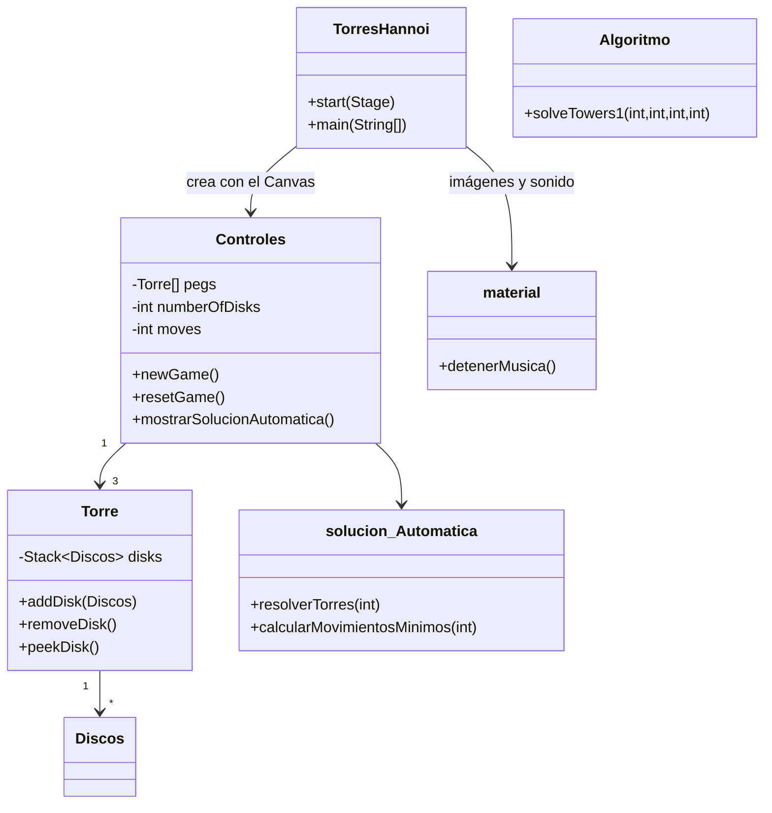

<div align="center">
  
  <h1>HanoiTowers</h1>
  <p><b>Juego de escritorio de las Torres de Hanoi en Java + JavaFX, con arrastrar y soltar y solución automática recursiva.</b></p>

  
  
  
  
  

  <p>
    <a href="#-inicio-rápido">Inicio rápido</a> ·
    <a href="#-características">Características</a> ·
    <a href="#-arquitectura">Arquitectura</a> ·
    <a href="#-pruebas">Pruebas</a> ·
    <a href="#-lo-que-todavía-no-existe">Limitaciones</a>
  </p>
</div>

HanoiTowers es un simulador jugable del rompecabezas de las Torres de Hanoi hecho con Java y JavaFX (proyecto de
NetBeans/Ant): el usuario mueve los discos con el ratón o pide que la máquina los resuelva paso a paso con un
algoritmo recursivo. Es un proyecto académico de escritorio: **no** es una aplicación web ni tiene puntuaciones
guardadas, red ni pruebas automatizadas.

## 🎬 Vista rápida

No se incluyen capturas: el repositorio trae los JAR de JavaFX sin las bibliotecas nativas, así que la ventana no se
pudo abrir de forma automatizada en esta revisión. Flujo real de uso según el código:

```text
Menú "Nueva Partida" (Ctrl+N)  -->  elegir número de discos (1 a 10)
        |
        v
Arrastrar el disco superior de una torre a otra  --> si el disco es mayor que el de destino: "Movimiento Incorrecto"
        |
        v
Contador de movimientos + cronómetro mm:ss visibles en el lienzo
        |
        v
Los n discos en la 3.ª torre --> "Perfectooo!!!!" si moves = 2^n - 1, si no "Bien Hecho!!!!"
        |
        +--> Botón "Solución Automática": anima los 2^n - 1 movimientos (0,5 s cada uno) y abre la lista de pasos
```

## ✨ Características

| Característica | Detalle |
| --- | --- |
| Juego con ratón | Arrastrar y soltar el disco superior entre 3 torres; los movimientos inválidos se rechazan con un aviso |
| Niveles | Diálogo para elegir de 1 a 10 discos (por defecto 3) |
| Marcadores | Contador de movimientos y cronómetro en el lienzo |
| Fin de partida | Aviso al completar; distingue la solución óptima (2^n − 1 movimientos) |
| Solución automática | Calculada con recursividad (`solucion_Automatica`), animada con `Timeline` y con ventana de texto "Pasos de la Solución" |
| Menú y atajos | Nueva partida `Ctrl+N`, reiniciar `Ctrl+R`, salir |
| Multimedia | Música de fondo en bucle (`Sonido_Fondo.wav`, `javax.sound.sampled`) y dos imágenes (logos UPDS) |
| Demo en consola | `Algoritmo.Algoritmo` imprime la solución recursiva para 3 discos por la salida estándar |

## 🏗️ Arquitectura



<details>
<summary>Estructura de carpetas</summary>

```text
src/
  torreshanoi/   # TorresHannoi (Application), Controles (lógica + dibujo en Canvas), Torre, Discos,
                 # solucion_Automatica, material (recursos)
  Algoritmo/     # Algoritmo.java: versión de consola
  imagenes/      # LOGO_FX.png, UPDS.png, UPDS_FX.png
  sonidos/       # Sonido_Fondo.wav
nbproject/, build.xml, manifest.mf   # proyecto NetBeans/Ant
build/, dist/    # artefactos compilados versionados (TorresHanoi.jar, JAR de JavaFX)
```

</details>

## 🚀 Inicio rápido

| Requisito | Detalle |
| --- | --- |
| JDK | 21 (`javac.source/target=21` en `nbproject/project.properties`); en esta revisión compiló con JDK 25 |
| JavaFX SDK | 23.0.1 (con las bibliotecas nativas), descargable desde openjfx.io |
| Sistema | Rutas relativas a `src/`: ejecutar **desde la raíz del repositorio** |

```bash
# Compilar (ajusta JAVAFX_LIB a la carpeta lib del SDK de JavaFX)
javac --module-path "$JAVAFX_LIB" --add-modules javafx.controls,javafx.fxml \
      -d out $(find src -name "*.java")

# Ejecutar el juego (clase de la GUI)
java --module-path "$JAVAFX_LIB" --add-modules javafx.controls,javafx.fxml \
     -cp out torreshanoi.TorresHannoi

# Solo la demo de consola
java -cp out Algoritmo.Algoritmo
```

También puedes abrir la carpeta como proyecto en **Apache NetBeans** con una biblioteca `JAVAFX` apuntando a tu SDK (F6 ejecuta el juego).

> La compilación y la demo de consola se verificaron; el arranque de la ventana no se pudo verificar (ver Vista rápida).

<details>
<summary>Configuración del proyecto NetBeans</summary>

- `main.class` apunta a `torreshanoi.Launcher`, que delega en la aplicación gráfica `torreshanoi.TorresHannoi` (la demo de consola sigue siendo `Algoritmo.Algoritmo`). El `Main-Class` de `dist/TorresHanoi.jar` es el mismo.
- `run.jvmargs` usa `${libs.JAVAFX.classpath}` (la biblioteca JAVAFX de tu NetBeans) en lugar de una ruta absoluta del autor.
- `dist/lib/` incluye JAR de JavaFX 23.0.1, pero sin bibliotecas nativas: no bastan por sí solos para abrir la GUI.

</details>

## 🧪 Pruebas

No hay pruebas automatizadas (ni carpeta `test/`). Verificación manual: jugar una partida con distintos números de
discos y contrastar el contador con 2^n − 1.

## 🚧 Lo que todavía no existe

- Pruebas unitarias, CI, LICENSE y capturas de pantalla.
- Ranking o guardado de partidas: no existe.
- `Solución Automática` mueve los discos desde el estado actual del tablero sin reiniciarlo (lectura de código,
  no comprobado en ejecución): puede fallar si ya hay movimientos hechos; conviene reiniciar antes.
- El JAR de `dist/` ahora arranca el juego (`Launcher`), pero sigue sin poder abrir la ventana por sí solo: `dist/lib` no incluye las bibliotecas nativas de JavaFX (usa `java --module-path <SDK>/lib --add-modules javafx.controls,javafx.fxml -jar dist/TorresHanoi.jar`). El repo versiona `build/` y `dist/` (≈ 14 MB de binarios).
- Rutas de imágenes y sonido relativas al directorio de trabajo (`src/...`); se leen del disco (`File`), no del classpath del JAR.
- Nombres de clase fuera de la convención Java (`material`, `solucion_Automatica`) y la clase se llama `TorresHannoi`.
- `nbproject/private/` (rutas locales del autor) está versionado.

## 📄 Licencia

Sin licencia definida: todos los derechos reservados por defecto.

<div align="center">
  <sub>Hecho por Luiss2080 · HanoiTowers</sub>
</div>
